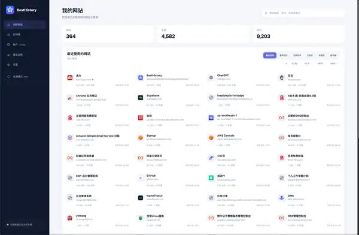
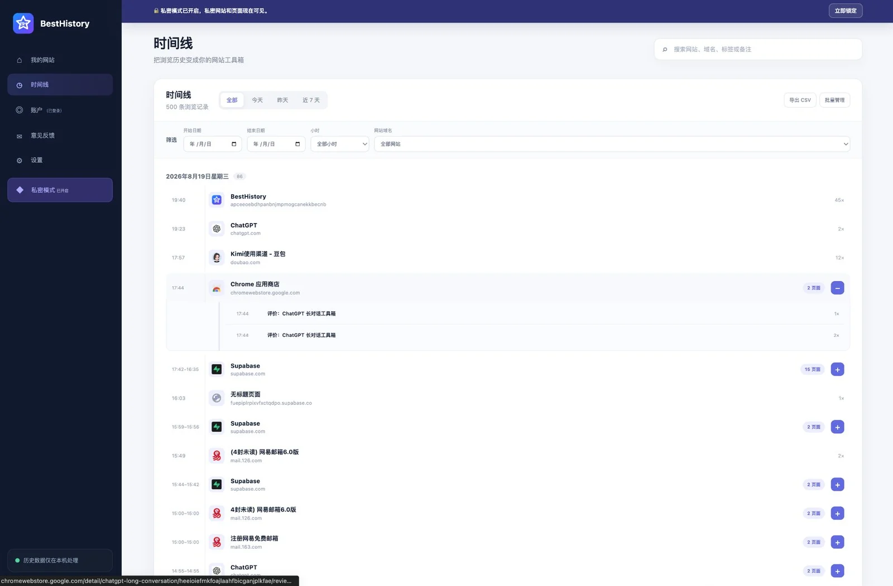
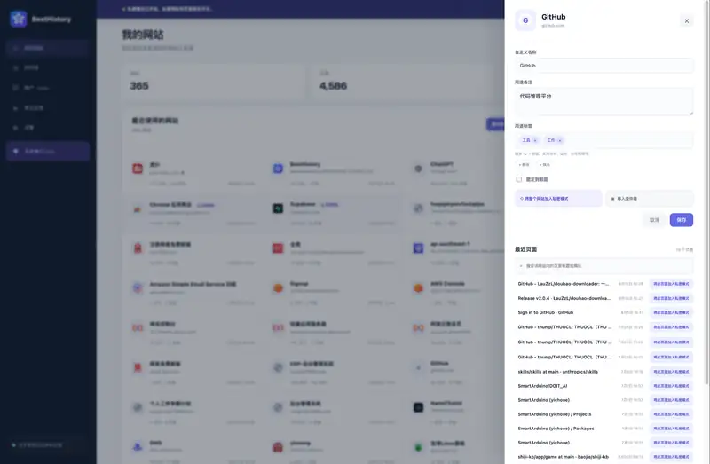
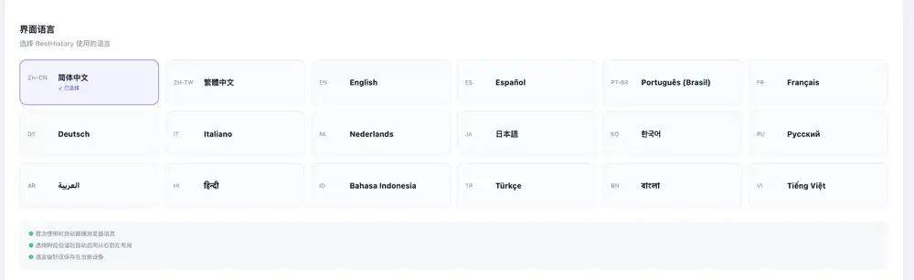

# BestHistory

  

<strong>把浏览历史变成真正能重新找回的网站工具箱。</strong>

<!-- BESTHISTORY_SEO_STEP27_SUMMARY_START -->

BestHistory 是一款面向 Chrome / Chromium 的隐私优先浏览历史管理器：它可以搜索旧的浏览记录、找回曾经访问过但已经忘记名称的网站，并按照网站、标签和备注重新组织历史数据。

<!-- BESTHISTORY_SEO_STEP27_SUMMARY_END -->

简体中文 · [繁體中文](docs/zh-TW/README.md) · [English](docs/en/README.md) · [日本語](docs/ja/README.md) · [한국어](docs/ko/README.md) · [Español](docs/es/README.md) · [Português](docs/pt/README.md) · [Français](docs/fr/README.md) · [Deutsch](docs/de/README.md) · [Italiano](docs/it/README.md) · [Nederlands](docs/nl/README.md) · [Русский](docs/ru/README.md) · [العربية](docs/ar/README.md) · [हिन्दी](docs/hi/README.md) · [Bahasa Indonesia](docs/id/README.md) · [Türkçe](docs/tr/README.md) · [বাংলা](docs/bn/README.md) · [Tiếng Việt](docs/vi/README.md)

  <a href="https://github.com/renboxue/BestHistory/releases/tag/v0.1.0-beta"><strong>⬇️ 下载 Chrome Beta v0.1.0</strong></a>
  &nbsp;·&nbsp;
  <a href="INSTALL.md">安装说明</a>
  &nbsp;·&nbsp;
  <a href="docs/LANGUAGES.md">18 种语言文档</a>

<!-- BESTHISTORY_SEO_STEP27_CN_GUIDES_START -->
## 想找以前访问过、但已经忘记名字的网站？

BestHistory 主要解决的不是“把 Chrome 历史记录换个皮肤”，而是几个非常具体的问题：**怎么搜索很久以前的 Chrome 历史记录、怎么找回曾经访问过但已经忘记名称的网站，以及怎么按照网站而不是几万条页面记录来整理浏览历史。**

- [怎么搜索很久以前的 Chrome 历史记录](docs/zh-CN/guides/search-old-chrome-history.md)
- [怎么找回以前访问过、但已经忘记名字的网站](docs/zh-CN/guides/find-website-you-visited-before.md)
- [Chrome 历史记录管理器应该解决什么问题](docs/zh-CN/guides/chrome-history-manager.md)
- [English browser-history guides](docs/en/guides/index.md)

<!-- BESTHISTORY_SEO_STEP27_CN_GUIDES_END -->

---

## 写在前面：为什么会有 BestHistory

BestHistory 是我作为一名个人开发者，因为自己的真实困扰做出来的一个小工具。

我平时经常会遇到这样的情况：

- 前几天明明用过一个很好用的网站，真正需要的时候却怎么也想不起名字；
- 只记得“好像是在某个网站里看到过”，但具体是哪一个页面已经完全没有印象；
- 因为担心以后找不到，我会一直开着很多标签页和浏览器窗口；
- 一些常用网站不敢关，只能固定标签页；
- 再重要一点的网站就塞进收藏夹，时间久了收藏夹自己又变成了另一座很难整理的仓库；
- 最后浏览器里同时堆着历史记录、固定标签、收藏夹和几十个不敢关闭的页面，但真正想找一个以前用过的网站时，依然要翻很久。

我慢慢发现，我真正想要的其实不是另一条更漂亮的“历史记录列表”。

我需要的是一种更接近人记忆习惯的方式：

**我可能记不得页面标题，也记不得是哪一天访问的，但我往往记得“那是一个什么网站”“我大概用它做过什么”。**

于是有了 BestHistory。

它想做的事情很简单：

> **让你敢于关掉那些“怕以后找不到”的标签页。**  
> 因为真正需要的时候，BestHistory 应该能帮你把它重新找回来。

目前 BestHistory 仍然是一个很早期的个人项目。如果它刚好也解决了你的困扰，我会非常开心。也很希望你能告诉我哪些地方好用、哪些地方不好用，以及你真正希望它继续解决什么问题。

  

把成千上万条页面历史先还原成“我用过哪些网站”。

---

## BestHistory 和普通历史记录有什么不同？

### 1. 先看“网站”，而不是先看几万条页面记录

这是 BestHistory 最核心的功能。

浏览器原生历史通常会把每一次页面访问都平铺出来。如果一天在同一个网站里点开几十个页面，历史记录里就会出现几十条几乎挤在一起的记录。

BestHistory 会先自动按照**网站**进行聚合。

你看到的首先是：

- 我最近访问过哪些网站；
- 哪些网站我经常使用；
- 某个网站最近什么时候访问过；
- 这个网站下面曾经打开过哪些具体页面。

对我自己来说，这比先面对一长串页面标题更容易回忆。

### 2. 用不同方式排序，快速看清自己真正经常使用的网站

同一批历史记录，可以用不同角度重新查看：

- **最近访问** — 最近用过什么，一眼就能看到；
- **最常访问** — 把真正经常使用的网站排在前面；
- **名称排序** — 已经记得名字时，可以更快找到；
- **已固定** — 把重要、常用的网站长期留在最前面；
- **未整理 / 废件箱 / 私密网站** 等不同状态，也可以单独查看。

我希望 BestHistory 最终能让“我平时到底在用哪些网站”这件事变得非常清楚。

### 3. 给网站加自己的标签

很多网站很难只属于一个官方分类。

同一个网站，对别人可能是“工具”，对你可能是“工作”；也可能同时属于“设计”“AI”“以后还会用”。

所以 BestHistory 支持给网站添加**自定义标签**，而且一个网站可以拥有多个标签。

标签不是为了把所有东西整理得非常完美，而是为了未来某一天，你只记得“它大概是做什么的”时，还能有一条路把它找回来。

### 4. 时间线按网站折叠，不再被同一个网站刷屏

有时候我们还是需要按照时间回忆：

> “我昨天下午到底看了些什么？”

所以 BestHistory 保留了时间线，但不会简单复制浏览器原生历史。

连续访问同一个网站的多个页面，会先折叠成一组，需要时再展开具体页面。这样既保留浏览过程，又不会因为在同一个网站里连续点击很多页面，让整条时间线变得非常嘈杂。

  

同一个网站连续打开的页面折叠在一起，时间线更像“浏览过程”，而不是一堵页面标题墙。

### 5. 给网站写一句“只有自己看得懂”的描述

这也是我自己非常需要的功能。

有些网站名字本身并不能提醒我它到底是干什么的。所以你可以给网站添加自己的备注或描述，比如：

> “上次用来把 PDF 转成图片的那个网站”

> “做儿童插画时找到的参考站”

> “那个可以查历史价格的小工具”

以后搜索这些你自己写过的话，也可以重新找到网站。我觉得这种信息有时候比网站官方标题更接近我们的真实记忆。

  

网站可以有自己的名称、备注、标签，也可以继续查看它下面曾经访问过的页面。

---

## 私密模式：有些历史我也想记住，但不想让别人看到

这是 BestHistory 里我非常重视的一部分。

浏览历史有一个很尴尬的问题：有些网站并不是“不想留下记录”，而只是**不希望它们和普通浏览历史放在一起，被其他人随手看到**。

所以 BestHistory 提供了 **私密模式（Pro）**。

私密模式中的网址、页面标题和访问记录会在本机加密保存。只有输入你设置的私密密码后才能查看。

它还可以配合浏览器的**无痕窗口**使用：

- 普通浏览器通常会在关闭无痕窗口后丢弃这些历史；
- 如果你愿意授权 BestHistory 在无痕模式中运行，BestHistory 可以自动把这些访问记录加密保存到私密模式；
- 它们不会混入普通网站列表；
- 私密模式锁定后，也不会直接显示这些网站和页面。

换句话说：

> **那些不方便留在普通历史里的网站，BestHistory 也可以帮你悄悄记住。**

私密数据仍然保存在你的设备上，BestHistory 的服务器不会保存你的私密网址、页面标题、私密浏览记录或私密模式密码。

---

## 搜索：不需要记得网站叫什么

BestHistory 的搜索不仅仅匹配域名。

目前可以通过网站、域名、标签、备注以及页面标题等信息进行查找。你可能完全忘记某个网站叫什么，只记得“以前在里面看过某个内容”，BestHistory 会尽量利用过去访问过的页面标题和你自己留下的信息，把那个网站重新找出来。

进入网站以后，还可以继续查看和搜索它下面曾经访问过的具体页面。

---

## 固定、废件箱和整理

不是所有历史都需要同样对待。

- **固定网站**：真正经常使用的网站可以固定在前面；
- **废件箱**：暂时不想看到的网站可以先移进去，而不是马上删除历史；
- **恢复**：以后发现还需要，可以再移回来；
- **永久删除**：确认不再需要时，可以从 BestHistory 和对应浏览器历史中删除。

我的想法是：整理历史记录不应该要求用户一开始就做很多艰难决定。“先放一边，以后再处理”本身就应该是一种正常操作。

---

## 备份、恢复与跨浏览器迁移

BestHistory 的浏览历史整理数据主要保存在本机。

你可以导出一个 `.bhbackup` 备份文件，用于：

- 更换电脑；
- 重新安装浏览器或 BestHistory；
- 将 BestHistory 数据迁移到另一台设备；
- 在不同浏览器之间迁移和合并 BestHistory 历史整理数据。

恢复时采用安全合并逻辑：已有数据不会简单粗暴地整库覆盖，备份中的历史和当前数据会尽量去重合并。

私密模式的数据在备份中仍保持加密状态；恢复私密数据时需要原来的私密密码。

此外，时间线中的历史记录还可以导出为 CSV，方便需要时用 Excel、Numbers 或其他表格软件查看和分析。

> 目前这里更准确地说是“通过本地备份文件迁移和合并”，而不是把你的完整浏览历史上传到云端做实时同步。

我刻意选择了这种方式，因为我更希望 BestHistory 首先是一款**本地优先**的工具。

---

## 隐私：这是我不希望为了功能妥协的一件事

BestHistory 会接触到浏览历史，而浏览历史本身就是非常私人的数据。

### 浏览数据留在你的设备上

BestHistory 服务器不会保存：

- 浏览历史；
- 访问过的网址；
- 页面标题；
- 网站标签和备注；
- 搜索内容；
- 私密网站和私密浏览记录；
- 私密模式加密密钥；
- 你的 `.bhbackup` 备份内容。

### 如果你选择登录，服务器只处理账户和会员权益

可能保存的信息主要包括：

- BestHistory 账户标识；
- 邮箱及必要的登录认证信息；
- 界面语言；
- Free / Trial / Pro 权益状态；
- 未来正式付费后所需的订阅状态和支付平台标识。

更详细的信息可以查看 [PRIVACY.md](PRIVACY.md)。

---

## Free 与 Pro

我不希望用户为了试一个浏览历史工具就必须先注册账号。

因此 BestHistory 的核心本地历史功能，**无需登录也可以长期使用**。

目前 Beta 阶段：

- 不登录也可以使用 Free 功能；
- 新注册 BestHistory 账号会获得 **30 天 Pro 免费试用**；
- 当前 Pro 最主要的功能是私密模式；
- 试用时长和未来 Pro 功能会根据真实用户反馈继续调整。

登录的主要作用是识别会员权益，不会因此把你的浏览历史上传到 BestHistory 服务器。

---

## 18 种界面语言，也提供 18 种文档

BestHistory 目前支持：

简体中文、繁体中文、English、日本語、한국어、Español、Português、Français、Deutsch、Italiano、Nederlands、Русский、العربية、हिन्दी、Bahasa Indonesia、Türkçe、বাংলা、Tiếng Việt。

  

这次公开 Beta 的 README、安装、隐私、FAQ、安全说明、更新日志和 Release Note 也提供对应的 18 种语言版本。完整入口见 [docs/LANGUAGES.md](docs/LANGUAGES.md)。

---

## 现在还只是开始

BestHistory 目前仍然是一个很早期的 Beta 产品。

我最开始做这个插件，就是因为自己总是：

> 怕关掉标签页以后再也找不到，所以浏览器里长期堆着很多标签和窗口。

现在 BestHistory 已经能帮助我重新找到关闭过的网站。未来我也希望继续围绕这个核心问题思考：怎样让我们更放心地关闭不再需要一直开着的标签页、怎样更轻松地整理自己真正使用过的网站，而不是单纯不断增加功能。

但我不想在没有真实用户之前，把所有自己想到的功能全都做进去。所以现在最需要的是你的反馈。

---

## 如果你愿意支持这个项目

如果 BestHistory 也刚好解决了你的问题，我会很感谢你：

- ⭐ 给这个仓库一个 Star，让我知道确实有人需要它；
- 🐛 遇到问题时提交一个 GitHub Issue；
- 💡 告诉我你平时是怎么管理历史记录、收藏夹和一大堆标签页的；
- ✉️ 如果不方便公开反馈，也可以发邮件到 **besthistory@126.com**。

哪怕只是告诉我“这个功能我真的会用”或者“这个设计我觉得很麻烦”，对一个个人开发项目来说，都非常有价值。

如果你提交公开 Issue，请不要附上私密网址、私密浏览记录、密码、备份文件或其他敏感浏览数据。

谢谢你愿意看到这里，也谢谢你愿意尝试 BestHistory。

---

## Beta 安装

BestHistory v0.1.0 Beta 已经可以通过 GitHub Release 下载：

**[⬇️ 下载 BestHistory v0.1.0 Beta for Chrome](https://github.com/renboxue/BestHistory/releases/tag/v0.1.0-beta)**

当前仍需要通过 Chrome 的“开发者模式 → 加载已解压的扩展程序”安装。详细步骤见 [INSTALL.md](INSTALL.md)。

---

## 关于这个仓库

这个 GitHub 仓库用于产品介绍、Beta 版本发布、使用文档、隐私与安全说明，以及 Issue 与用户反馈。

**BestHistory 应用源码目前为非开源专有代码，不会在这个公开仓库中发布。**

---

## 当前版本

**v0.1.0 Beta**

版本变化请查看 [CHANGELOG.md](CHANGELOG.md)。
